  <!-- Header Banner -->
  

  <!-- Animated Typing SVG -->
  

---

  <!-- Animated Tech Ecosystem Banner -->
  

    

  <!-- Animated Terminal Typing Status for Tech Stack -->
  

    

  <!-- Category: Mobile Development -->
  <h3>
    
    &nbsp;Mobile Development
  </h3>

  

    
    
    
    
  

   

  <!-- Category: Programming Languages -->
  <h3>
    
    &nbsp;Programming Languages
  </h3>

  

    
    
    
    
    
    
  

   

  <!-- Category: Tools & Workflow -->
  <h3>
    
    &nbsp;Tools &amp; Workflow
  </h3>

  

    
    
    
    
    
    
  

