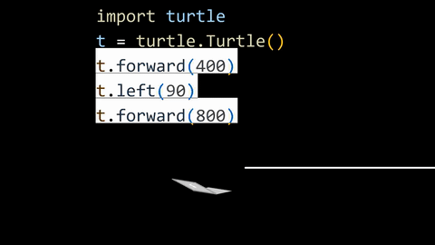

  

  

 

  
  &nbsp;
  
  &nbsp;
  

---

### 👨‍💻 About Me

> *"Turning complex problems into simple, elegant code."*

- 📱 **Mobile Development Enthusiast**: Passionate about creating responsive, fluid, and high-performance cross-platform mobile applications.
- ⚡ **Core Competency**: Focused on **Flutter & Dart**, reactive state management, and modern component architecture.
- 💻 **Multi-Language Knowledge**: Proficient in **Dart**, **Python**, and **Java** for logic, backend scripting, and mobile foundations.
- 🎨 **User Experience**: Dedicated to pixel-perfect layouts, interactive animations, and smooth touch feedback.
- 💬 **Let's Talk About**: Flutter architecture, Dart programming, animations, and cross-platform UI.

---

### 🛠️ Tech Stack & Skills

| 📱 Mobile Development | 💻 Programming Languages | ⚙️ Tools & Workflow |
| :---: | :---: | :---: |
|  &nbsp;  |  &nbsp;  &nbsp;  |  &nbsp;  &nbsp;  |
| **Flutter • Dart** | **Dart • Python • Java** | **Git • GitHub • VS Code** |

 

---

### 📊 GitHub Analytics

  
  &nbsp;&nbsp;
  

