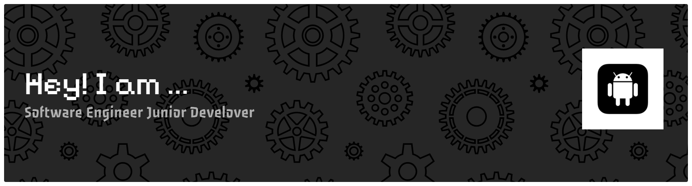

  

---

### 🛠️ Tech Stack & Skills

#### 📱 Mobile Development

  
  

#### 💻 Programming Languages

  
  
  

#### ⚙️ Tools & Workflow

  
  
  

---

### 🎮 Mini Game: Arrow Maze

  
Coba taklukkan labirin panah satu arah langsung di browser atau HP Anda!

   
  

